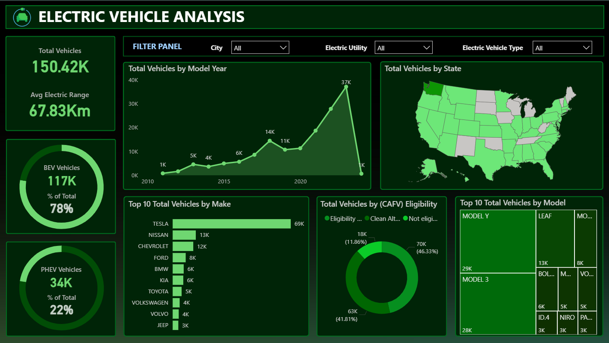

# ⚡ Electric Vehicle Market Analysis

## 📷 Dashboard Preview

## 📌 Project Overview

The Electric Vehicle (EV) industry is rapidly expanding due to environmental awareness, government incentives, and technological advancements. Understanding adoption trends, manufacturer dominance, and regional distribution is essential for policymakers, investors, and automobile manufacturers.

This project analyzes EV market data using Power BI to uncover growth patterns, brand dominance, geographical penetration, and consumer preferences. The objective was to convert raw electric vehicle data into structured, decision-focused insights using KPIs and interactive visual storytelling.

## 🎯 Problem Statement

The objective of this analysis was to evaluate the overall EV landscape, including Battery Electric Vehicles (BEVs) and Plug-in Hybrid Electric Vehicles (PHEVs), in order to:

- Assess total market size and growth trends  
- Analyze technological advancement through average electric range  
- Identify leading manufacturers and popular models  
- Examine state-wise adoption patterns  
- Understand the impact of CAFV (Clean Alternative Fuel Vehicle) eligibility  

## 📊 Key Performance Indicators (KPIs)

- **Total Vehicles:** 150.42K  
- **Average Electric Range:** 67.83 Km  
- **Total BEV Vehicles:** 117K (78%)  
- **Total PHEV Vehicles:** 34K (22%)  

These KPIs provide a high-level summary of EV market structure and dominance of fully electric vehicles.

## 📈 Dashboard Analysis & Insights

### 1️⃣ EV Growth Trend (2010 Onwards)
A line chart visualizes the steady growth of electric vehicles, showing rapid adoption post-2018, indicating increased policy support and market acceptance.

### 2️⃣ State-wise EV Distribution
A map visualization highlights geographical penetration of EVs, helping identify regions with higher adoption rates and growth potential.

### 3️⃣ Top 10 Manufacturers
Tesla leads the EV market, followed by Nissan and Chevrolet, reflecting strong brand dominance and consumer trust.

### 4️⃣ CAFV Eligibility Analysis
A donut chart illustrates the proportion of vehicles eligible for clean fuel incentives, showcasing the role of government policies in accelerating EV adoption.

### 5️⃣ Top 10 Models
A treemap highlights popular EV models such as Model Y and Model 3, reflecting consumer demand trends.

## 🛠 Tools & Technologies Used

- Power BI 
- DAX (Calculated Measures & KPIs)  
- Interactive Dashboard Design  

## 💡 Business Value

This dashboard can assist:

- Policymakers in evaluating EV adoption impact  
- Manufacturers in analyzing market positioning  
- Investors in identifying growth opportunities  
- Analysts in tracking regional and brand-level performance  

## 🧠 Key Learnings

- Designing structured KPIs for business analysis  
- Applying data storytelling principles  
- Building interactive dashboards with slicers and filters  
- Converting raw data into strategic insights  

